# Diagrams

Architecture, communication, control and AI workflow diagrams for the ESP32 Smart Farm project.

---

## System Architecture

Overview of both ESP32s, their tasks and the UART2 communication link.

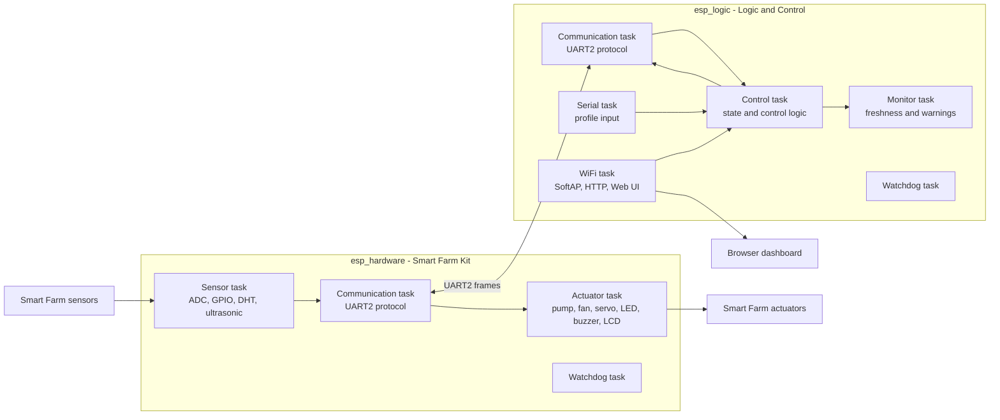

---

## FreeRTOS Task Overview

Task structure, inter-task data flow and watchdog monitoring on both ESP32s.

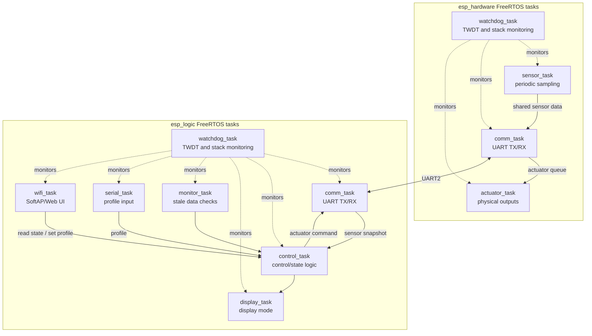

---

## UART Communication Sequence

Cyclic sensor/actuator frame exchange between both ESP32s including the failsafe path.

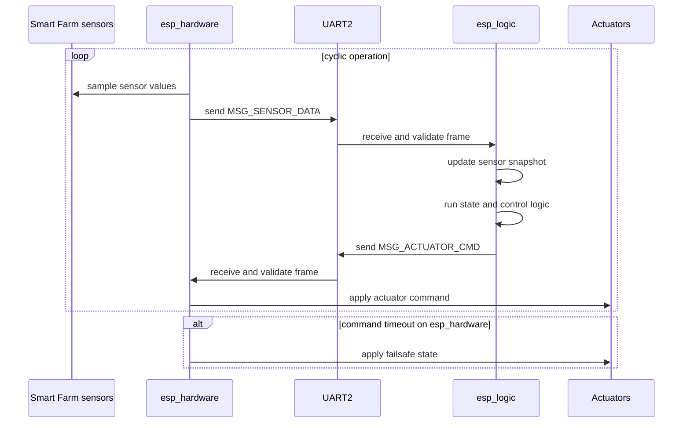

---

## Web UI Sequence

Browser interaction with the SoftAP dashboard and the read/write API.

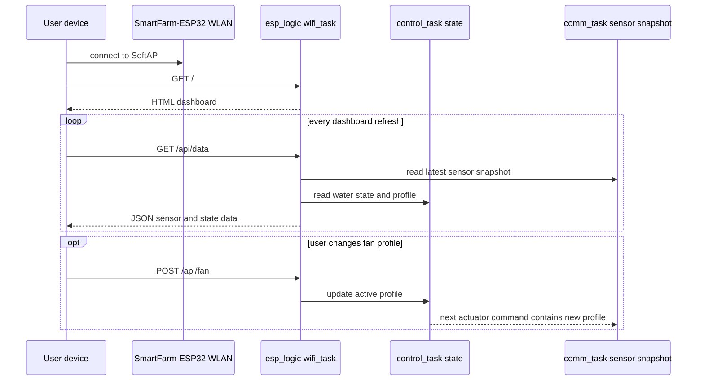

---

## Water State Machine

Two-state hysteresis for water level classification.

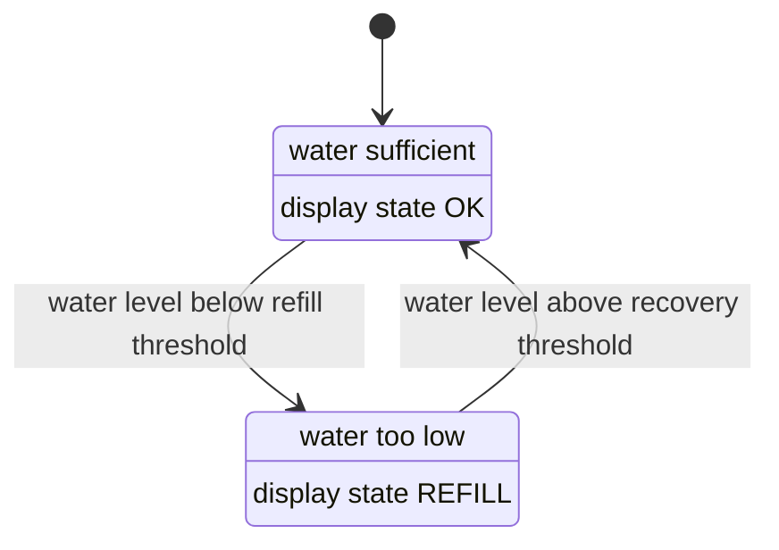

---

## Light and Alarm State Machine

Day/night detection with PIR alarm behavior during night mode.

```mermaid
stateDiagram-v2
    [*] --> DAY
    DAY --> NIGHT: low LDR value confirmed
    NIGHT --> DAY: high LDR value confirmed

    DAY: servo in day position
    DAY: night alarm inactive
    NIGHT: servo in night position
    NIGHT: PIR alarm can be armed after guard time

    state NIGHT {
        [*] --> Guard
        Guard --> Armed: guard time elapsed
        Armed --> Alarm: PIR movement detected
        Alarm --> Armed: alarm hold time elapsed
    }
```

---

## Control Algorithm Flow

Main control cycle in `control_task`: sensor evaluation, state updates and actuator command generation.

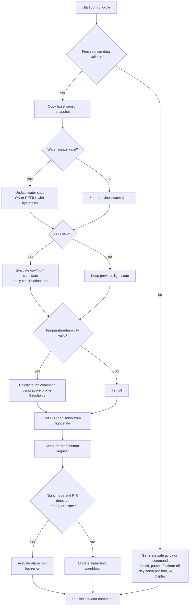

---

## Sensor Validation Flow

Sensor sampling pipeline in `sensor_task` including rate-of-change checks and plausibility guards.

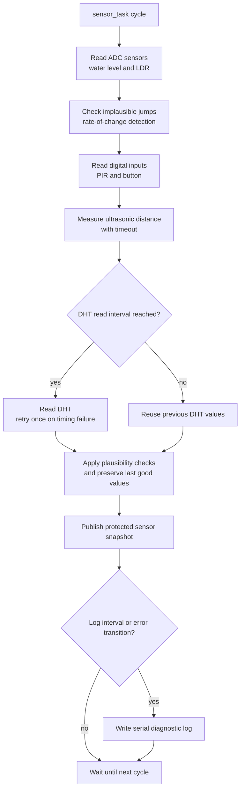

---

## Actuator Safety Flow

Actuator execution in `actuator_task` including servo hold logic and pump safety limiting.

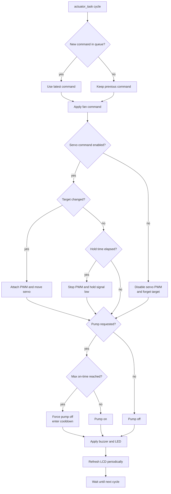

---

## Fault Handling Flow

Runtime fault sources and the corresponding safe reactions in each ESP32.

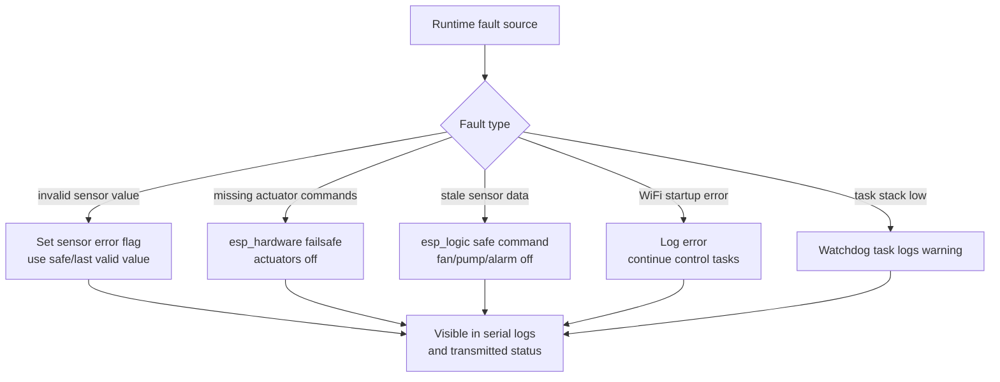

---

## Logging and Observability

Observability mechanisms and how they feed into thesis evaluation.

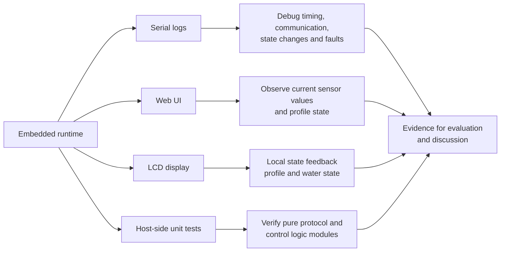

---

## AI Development Workflow

End-to-end flow from GitHub issue via Claude Code action to validated main branch.

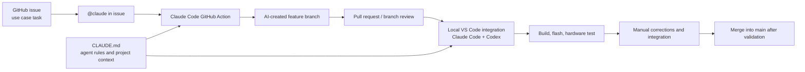

---

## AI Workflow Comparison

GitHub agent workflow versus IDE assistant workflow side by side.

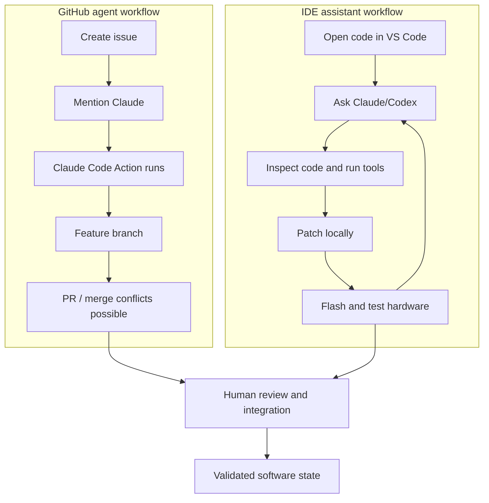

---

## Thesis Methodology Flow

Design-build-test methodology used throughout the project.

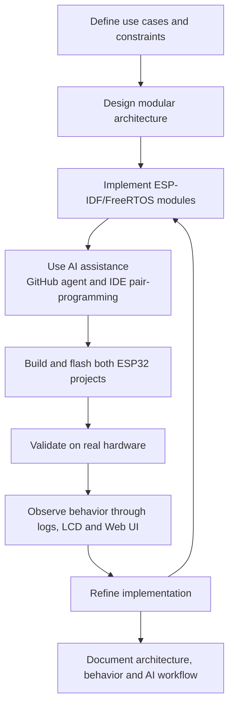
